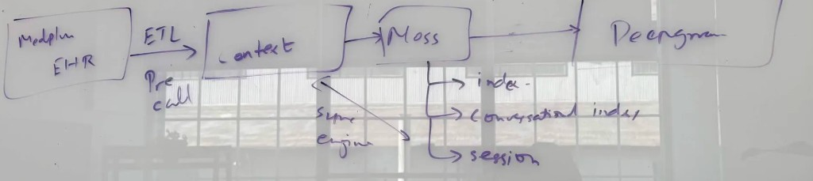

# Preflight agent — Medplum + Moss + LangGraph + Deepgram + Stedi

Voice-first **pre-visit check-in for any complaint**: talk → charted live into FHIR → deep
researched with real citations → n=1 plan proposed for human peer review → cost answered up
front. Every agent action runs behind a patient-scoped capability gateway.

## Architecture

```
Patient (phone / voice)
       ↓
Deepgram Nova-3 or text turn
       ↓
LangGraph agent
       ↓
CAPABILITY GATEWAY  ← binds session to ONE Patient (SMART patient=<id> compartment)
   │                  no tool accepts a patient id; subject injected server-side
   │                  every decision → FHIR AuditEvent
   ├── moss_search               ← patient's own history (Moss hybrid retrieval)
   ├── ensure_patient            ← issues the capability
   ├── chart_to_medplum          ← Encounter + Observation + Composition
   ├── deep_research             ← Europe PMC, retrieved citations only
   ├── propose_care_plan         ← DRAFT CarePlan + Provenance + peer-review Task
   ├── send_photo_capture_link   ← 15m HMAC URL → web /capture/:token
   ├── get_wearable_risk         ← Whoop / Open Wearables
   ├── check_eligibility         ← Stedi coverage + out-of-pocket
   └── request_human_handoff
       ↓
Medplum: Encounter · Observation · Composition · CarePlan(draft) · Provenance · Task · AuditEvent
         Binary (securityContext=Patient) + DocumentReference / Media
       ↓
Human clinician commits the plan at /review → status becomes active
```

The gateway is the novel piece: see [`docs/AGENT_GOVERNANCE.md`](../docs/AGENT_GOVERNANCE.md)
for why the subject of care must never be a tool argument, and the HAARF scorecard that
measures it.

Secure photo path uses Medplum core ([Binary](https://www.medplum.com/docs/fhir-datastore/binary-data), [securityContext](https://www.medplum.com/docs/access/binary-security-context)). The phone never receives client secrets — only a short-lived capture token; upload is proxied by this API.

### Context pipeline, as whiteboarded



The read path we built matches this:

| Whiteboard | Code | Notes |
|---|---|---|
| Medplum EHR → **ETL, pre-call** | `synthea_import.bundle_to_docs` | FHIR Bundle flattened to text docs ahead of the call, not during it |
| **Context** | `data/sample_history.json` | 18 docs; merges the eczema and asthma bundles so retrieval isn't single-condition |
| Moss → **index** | `patient-history` via `ensure_index()` | Long-term lane, upserted idempotently, then `load_index` for sub-10ms queries |
| Moss → **session** | `preflight-session` via `add_turn()` | Live transcript turns, partitioned by `encounter` metadata |
| Moss → **conversational index** | `push_session()` | Promotes the session into a persisted index so a human inherits the conversation |
| Moss → **Deepgram** | `moss_search` on each turn | Retrieval grounds the reply; Nova-3 handles STT |
| **Super engine** | `graph.py` | The LangGraph agent that decides which lane to pull from |

Two deliberate departures. The whiteboard is one-directional — EHR out to the voice agent — but
the agent also **writes back** (Encounter, Composition, draft CarePlan), and that return arrow
is where every safety risk lives. Everything on the read path can be wrong and you get a bad
answer; get the write path wrong and you have altered the wrong person's chart. Hence the
capability gateway sitting between the agent and Medplum, which the diagram has no box for.

Second, `Context → Moss` needs a relevance floor. Moss always returns `top_k` documents with no
way to signal "nothing matched", so without one a knee complaint retrieves eczema history at
~0.6 and it enters the prompt as though it belonged there. See
[Known limitations](#known-limitations).

## Setup

```bash
cd agent
python -m venv .venv
source .venv/bin/activate
pip install -r requirements.txt
cp .env.example .env
# Fill OPENAI, MEDPLUM_*, MOSS_*, DEEPGRAM_*, optional STEDI_*
# PUBLIC_APP_URL=http://localhost:5173
# PUBLIC_API_URL=http://localhost:8080
# AGENT_MODE=live   # when Medplum/Moss keys ready
```

`.env` is read at process start, so a bare edit won't be picked up by a running
`uvicorn --reload` — touch a source file (or restart) and confirm with `GET /health`.

### Stedi test mode gotcha

Test mode accepts *published fixtures verbatim*. Any other name, member ID, or birth date
returns an `AAA` error instead of benefits — we spent a while getting `73 Invalid/Missing
Subscriber/Insured Name` before realising the payer/subscriber pair has to match the docs
exactly, and that several of the UnitedHealthcare fixtures are *designed* to fail so you can
test error handling. `stedi_client.py` pins the Aetna subscriber+dependent fixture
(payer `60054`, John Doe / `AETNA9wcSu`, dependent Jordan Doe), which returns 60 benefit
entries of real active coverage.

Stedi also ships an [MCP server](https://www.stedi.com/docs/healthcare/mcp-server) aimed
explicitly at "voice agents that need to verify benefits in real time" — the obvious upgrade
path from our direct HTTP call.

## Run

```bash
# API (port 8080)
uvicorn src.api:app --reload --port 8080

# Web UI (separate terminal)
cd ../web && npm install && npm run dev

# CLI
python -m src.cli doctor
python -m src.cli once "My right knee has been swollen for three weeks since I started running"

# Red-team the gateway with HAARF RT-1..RT-6 (no API key needed)
python scripts/haarf_scorecard.py --json data/haarf_scorecard.json

# Eczema fixtures → Moss long-term index (usemoss/moss: upsert + load_index)
python -m src.synthea_import --bundle data/synthea/sample_eczema_bundle.json
python -m src.seed_moss
# Live calls also use Moss sessions per encounter — see src/moss_retriever.py
# https://github.com/usemoss/moss

# E2E smoke (API must be up)
python scripts/smoke_preflight.py
```

### Key HTTP routes

| Method | Path | Purpose |
|--------|------|---------|
| GET | `/health` | Integration flags |
| POST | `/session/start` | Patient + Encounter |
| POST | `/turn` | Agent turn |
| POST | `/capture-links` | Issue secure photo URL |
| GET | `/capture/{token}` | Capture page metadata |
| POST | `/capture/{token}/upload` | Photo → Medplum Binary + DocumentReference |
| GET | `/chart/{encounterId}` | Clinician BFF — note, photos, proposals, citations, coverage |
| GET | `/binary/{binaryId}` | Stream photo bytes to the chart (creds stay server-side) |
| GET | `/capability` | Active patient-scoped capability + gateway stats |
| GET | `/audit` | Gateway decision ledger (bound vs referenced patient) |
| GET | `/review-queue` | AI-authored draft plans awaiting a human |
| POST | `/review/{carePlanId}` | Human commits or rejects → Provenance attester |
| POST | `/red-team/attempt` | Adjudicate an arbitrary tool call (RT-4 live demo) |
| GET | `/haarf/scorecard` | RT-1…RT-6 results against the gateway |
| GET | `/wearables/whoop/status` | Whoop app configured / strap connected |
| GET | `/wearables/whoop/authorize` | Start Whoop OAuth (returns URL to open) |
| GET | `/wearables/whoop/callback` | Whoop redirect → token exchange → back to app |
| GET | `/wearables/whoop/summaries` | Latest recovery + sleep (normalized and raw) |
| GET | `/wearables/risk` | Triage level from the connected strap, else mock |
| POST | `/wearables/to-chart` | Wearable snapshot → coded FHIR Observations |

## Connect a real Whoop

1. Sign in at [developer-dashboard.whoop.com](https://developer-dashboard.whoop.com/) with your Whoop account (needs an active membership), create a Team, then an App.
2. Scopes: enable exactly `offline read:recovery read:sleep` — one per endpoint we call, plus
   `offline` so tokens refresh. Whoop rejects the *entire* authorization request with
   `invalid_scope` if the app is not granted something you ask for, and the error names only the
   first offender, so asking for scopes you never read just costs you round trips.
3. Redirect URI must be exactly `http://localhost:8080/wearables/whoop/callback` — added under
   **Redirect URLs** on the app. A mismatch fails at Whoop before reaching us, so it never
   appears in our logs.
4. Put `WHOOP_CLIENT_ID` / `WHOOP_CLIENT_SECRET` in `.env` and restart the API.
5. Click **Connect my Whoop** on the web app, authorize, and you land back with `?whoop=connected`.
6. **Pull signals into chart** writes resting HR, HRV, SpO2, skin temp, recovery, sleep duration/efficiency/awake time as coded `Observation`s on the encounter.

Tokens are stored in `agent/.whoop_tokens.json` (gitignored, `0600`) and auto-refreshed via the `offline` scope. Without credentials the same routes return mock summaries, so the demo never hard-fails.

Closed-loop framing and the eczema signal rationale: [`docs/CLOSED_LOOP_SYNTHESIS.md`](../docs/CLOSED_LOOP_SYNTHESIS.md).

## Known limitations

Found by end-to-end testing of the voice and retrieval paths, and left honest rather than
papered over:

- **Moss index quota.** The account allows 3 indexes. Short-term turns now share one
  `preflight-session` index partitioned by `encounter` metadata instead of creating one index
  per visit, but `push_index()` still needs a free slot and returns HTTP 429
  `USAGE_LIMIT_EXCEEDED` until one exists. The failure is now logged and surfaced to the
  clinician in the handoff text; it used to be swallowed by `except Exception: pass`, so a
  handoff looked successful while the human got none of the conversation.
- **Retrieval only knows two conditions.** The long-term index holds 18 documents from the
  eczema and asthma Synthea bundles. A knee or headache complaint therefore correctly returns
  *no* history rather than pretending — see the relevance floor below.
- **Literature skew.** Europe PMC ranks "knee swelling" toward arthroplasty recovery, so a
  runner's overuse injury retrieves surgical rehab reviews. On-topic but not ideally matched;
  narrowing further tends to return nothing at all.
- **Escalation is keyword-tiered, not a model judgement.** Two tiers (911 vs. same-day) keyed
  off the handoff reason. Deliberately conservative and easy to audit, but it will not catch a
  red flag phrased in words we didn't anticipate.

### Two retrieval fixes worth knowing about

Moss always returns `top_k` documents; it has no concept of "nothing matched". Without a floor,
a knee complaint retrieved the patient's eczema history at ~0.6 and it landed in the prompt as
though it were relevant. `MIN_LONG_TERM_SCORE = 0.75` separates genuine hits (0.9–1.0) from
noise, so unrelated queries now return nothing:

| Query | Kept | Scores |
| --- | --- | --- |
| `asthma wheeze inhaler` | 4 | 0.98, 0.98, 0.95, 0.91 |
| `eczema flare` | 4 | 0.97, 0.96, 0.95, 0.91 |
| `allergies` | 2 | 0.99, 0.98 |
| `knee swelling` | 0 | — |
| `zzzz nonsense qqqq` | 0 | — |

Deep research previously ANDed every word of the complaint together and sorted by citation
count, so `"swollen AND knee AND after AND running"` matched almost nothing and Europe PMC
returned famous unrelated papers — cardiovascular statistics attached to a knee complaint.
`research.py` now maps lay speech to indexed vocabulary ("short of breath" → `dyspnea`), builds
quoted anatomy+symptom phrases, and walks a specificity ladder that prefers reviews and
guidelines, dropping the citation sort entirely.

## Progress

- [x] Patient-scoped capability gateway — subject of care from authorization, never tool args
- [x] Every gateway decision → FHIR `AuditEvent` (bound patient *and* referenced patient)
- [x] HAARF RT-1…RT-6 scorecard: 5/5 correct, 1/1 crossings blocked, 0 false positives
- [x] Deep research via Europe PMC — retrieved citations only, never generated
- [x] n=1 plan as DRAFT `CarePlan` + `Provenance` (AI author) + peer-review `Task`
- [x] Human commit flow → `status: active` + `Provenance` attester with reason
- [x] Condition-agnostic intake (knee, cough, rash, mental health — no specialty assumed)
- [x] LangGraph + Moss + Medplum + Stedi + handoff
- [x] Open Wearables risk tool
- [x] Whoop API v2 OAuth + eczema-aware risk rules + FHIR Observation write-through
- [x] Photo preview streamed to clinician chart via `/binary/{id}`
- [x] Synthea eczema bundle + importer
- [x] Secure capture tokens + Medplum Binary/DocumentReference path
- [x] FastAPI BFF + web capture/chart UI
- [x] Browser mic → Deepgram Nova-3 → `/voice/turn` → LangGraph (key server-side)
- [ ] Live Medplum ClientApplication credentials (fill `.env`)
- [ ] Full Deepgram Voice Agent WebSocket (duplex TTS) — mic STT path works now

### Loop (build → smoke)

```bash
# One tick
bash scripts/loop_tick.sh

# Agent keeps a fixed 10m loop armed in Cursor that runs smoke then wakes to ship the next gap.
```
