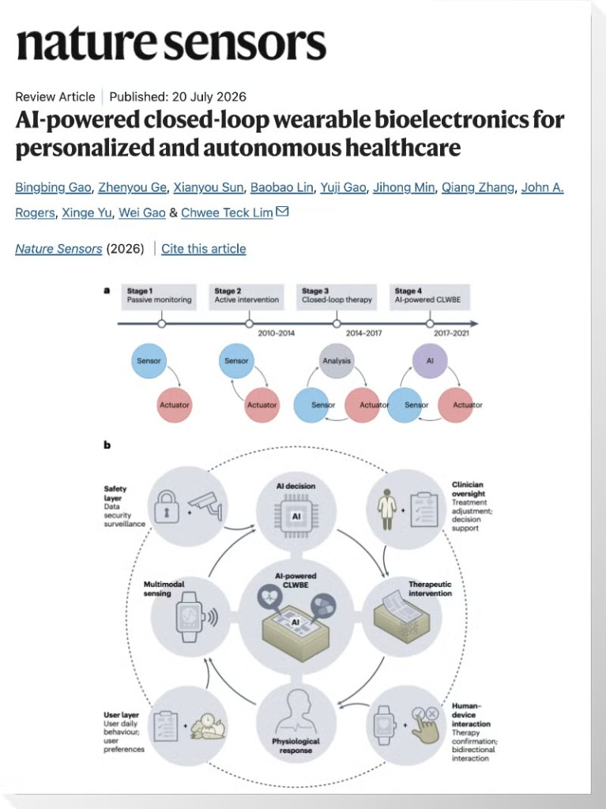

# Closed-loop framing for FlareCheck

Source: **“AI-powered closed-loop wearable bioelectronics for personalized and autonomous healthcare.”**
Gao, Ge, Sun, Lin, Gao, Min, Zhang, Rogers, Yu, Gao & Lim. *Nature Sensors*, review article, published 20 July 2026.

## What the paper argues

Wearable healthcare has moved through four stages:

| Stage | Era | Loop shape |
|-------|-----|------------|
| 1. Passive monitoring | pre-2010 | sensor only |
| 2. Active intervention | 2010–2014 | sensor ↔ actuator |
| 3. Closed-loop therapy | 2014–2017 | sensor → analysis → actuator |
| 4. AI-powered CLWBE | 2017–2021 | sensor → **AI** → actuator |

Stage 4 systems are organized as a loop with named layers: **multimodal sensing → AI decision → clinician oversight → therapeutic intervention → human–device interaction → physiological response**, wrapped by a **user layer** (daily behaviour, preferences) and a **safety layer** (data security, surveillance). Clinician oversight is drawn as part of the loop, not outside it — the AI proposes, the clinician adjusts.

## Why this matters for FlareCheck

The paper's loop is about bioelectronics that actuate on the body (drug delivery, stimulation). FlareCheck runs **the same loop with a care action as the actuator** instead of a device: the "intervention" is a photo request, a coverage check, and a clinician handoff. That is the honest version of this architecture we can ship today, and it is the framing to use in the demo.

Our mapping, layer by layer:

| Paper layer | FlareCheck implementation | Status |
|---|---|---|
| Multimodal sensing | Whoop recovery/HRV/RHR/skin-temp/sleep + patient voice (Deepgram) + skin photo (Binary) | Voice + photo live; Whoop wired, needs your credentials |
| AI decision | LangGraph agent, history-grounded via Moss | Live |
| Clinician oversight | Medplum chart (`/chart/:encounterId`), handoff Task | Live |
| Therapeutic intervention | Next-step recommendation, capture link, Stedi coverage check | Live (Stedi in mock) |
| Human–device interaction | Voice turn confirms before anything is charted | Live |
| Physiological response | Next-day wearable delta after the flare check-in | Partial — snapshot only, no trend yet |
| User layer | Moss long-term index of the patient's own history | Live |
| Safety layer | No diagnostic claims, 15-min single-use capture tokens, Binary `securityContext`, FHIR AccessPolicy + AuditEvent | Live |

## Two design rules we take from the paper

1. **Sensing must be multimodal or the AI decision is thin.** A rash photo alone is a picture; a rash photo plus fragmented sleep and elevated skin temperature is a flare trajectory. This is why Whoop belongs in the loop rather than as a side panel.
2. **Keep the clinician inside the loop, not after it.** We never auto-close an encounter. Every wearable-derived signal lands as a FHIR `Observation` with a device attribution, and the clinician sees the reasoning, not just a score.

## Eczema-specific signal reading

Nocturnal itch is the mechanism that makes wearables useful for eczema specifically:

- **Fragmented sleep / low efficiency** — scratching wakes the patient repeatedly
- **Time awake during sleep period ≥ 60 min** — proxy for itch burden
- **Elevated skin temperature** — barrier inflammation, also a scratch trigger
- **Low HRV / elevated resting HR / low recovery** — general inflammatory and sleep-debt load

These are combined in `OpenWearablesService.evaluate_risk` into a `low | moderate | high` **triage** level with explicit reasons. It is not a diagnosis and never phrased as one.

## What is deliberately not built

- No autonomous actuation (no dosing, no stimulation) — outside a hackathon's safety envelope
- No image-based severity scoring of the rash
- No trend model over weeks of wearable data (single snapshot today; the loop's "physiological response" arm is the obvious next build)
