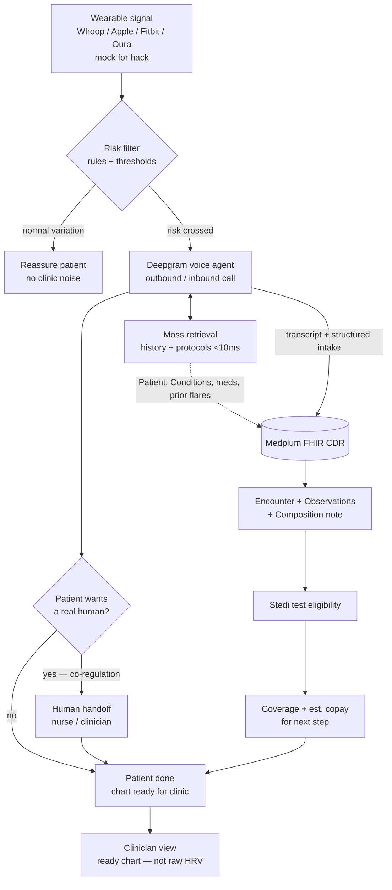
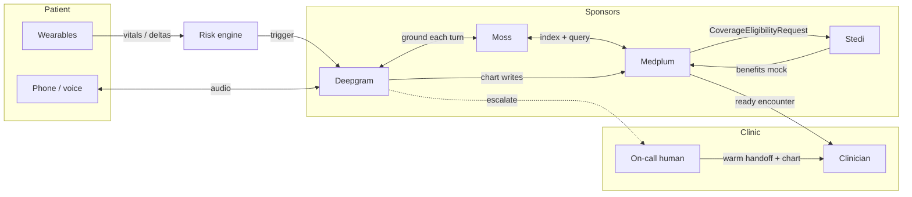

# Product brief — wearable risk → voice → FHIR chart → coverage

YC x Medplum Agentic Healthcare Hackathon · Aug 1, 2026  
Working names: *PreChart* / *PulseCheck* / *VitalsCall*

---

## One-liner

**Free wearable data from the phone** — when risk crosses a threshold, a history-aware voice agent checks in, charts into FHIR, checks coverage, and hands off to a human when the patient needs co-regulation.

---

## Problem statement

Wearables can detect physiologic stress days before people feel sick, and EHRs already hold the history that makes those signals clinically meaningful — but today those systems don’t connect into care. Patients get a silent notification (or nothing). Clinics get noise, not a chart. Between visits, deterioration is still discovered late: at symptom onset, an urgent appointment, or the ED.

Ambient AI is fixing documentation *during* visits. The gap is **between visits**: turning a wearable risk signal into a short, history-aware conversation, a structured FHIR encounter the clinician can trust, and a clear next step — including whether follow-up is covered and what it may cost — before the patient is already in trouble.

Millions now generate continuous consumer data (sleep, HR, temperature, cycle signals), but that data mostly **dies on the phone**. Clinicians aren’t trained or staffed to interpret month-long vital streams in a 15-minute visit, so they ignore the phone dump. We have **data abundance and action scarcity**.

What’s missing is not another sensor — it’s the **filter and bridge**: right signal → right moment of contact → EHR context → structured chart → covered next step → human when calm/trust requires it.

**Slide line:** Wearables see risk early; care still starts late — because alerts don’t become conversations, charts, or covered next steps.

**Curry-aligned line:** Free the data from the phone — then make only the *right* signal reach the patient and the chart.

---

## What we are / are not claiming

| Say | Don’t say |
|-----|-----------|
| Risk-triggered outreach / triage | Predictive diagnosis |
| Turns alerts into encounters | Replaces clinicians |
| Works with Apple / Whoop / Fitbit / Oura *signals* | We’re shipping a new FDA device today |
| FHIR system of record + human handoff | Another dashboard or chatbot that traps data |

---

## Hackathon fit

From the [YC x Medplum brief](https://www.medplum.com/blog/yc-medplum-hackathon-2026): voice-first, charted as it happens, history-aware, cost/coverage ahead of the doctor, enhance clinicians.

| Judge lens | How we hit it |
|------------|---------------|
| Potential impact | Between-visit deterioration → ready chart; less noise for clinicians |
| Sponsor tech | All four: Deepgram, Medplum, Moss, Stedi |

### End-to-end flow

### System context

| Sponsor | Role in demo |
|---------|----------------|
| **Deepgram** | Outbound/inbound voice check-in, barge-in, transcripts |
| **Medplum** | Chart write-path; clinician UI of live Encounter + note |
| **Moss** | Session + long-term index (conditions, meds, prior flares) each turn |
| **Stedi** | Mock eligibility for recommended next step |

---

## Demo script (90 seconds)

1. Dashboard: Patient with known history (e.g. asthma) + wearable trend red-lining  
2. System triggers Deepgram agent call  
3. Patient confirms symptoms; Moss pulls prior flares into questions  
4. Medplum Encounter + Observations + Composition update live  
5. Stedi: “Urgent telehealth — active coverage, est. $X copay”  
6. Optional: “Talk to a nurse/clinician” → handoff with chart already written  
7. Clinician view: ready note, not a raw HRV alert  

**Hackathon scope:** mock wearable feed + rule-based risk; one persona; one vertical slice by 5:00pm PT.

**Sample patients:** use [Synthea](https://mitre.github.io/fhir-for-research/modules/synthea-overview) for synthetic FHIR (privacy-safe, not de-identified real data). Repo importer: `python -m src.synthea_import` in `agent/` — see `agent/data/synthea/` and [pre-generated downloads](https://synthea.mitre.org/downloads).

**Wearable connect:** [Open Wearables](https://openwearables.io/docs) — one open-source API for Whoop, Oura, Fitbit, Garmin, Apple Health, etc. (OAuth + normalized recovery/sleep/HRV). Agent tool: `get_wearable_risk` → triage language only, not diagnosis. Skill: `.cursor/skills/open-wearables/`.

---

## Evidence & industry signal

### Science (wearables → early signal)

- [Nature Medicine — Snyder et al.](https://www.nature.com/articles/s41591-021-01593-2): real-time smartwatch alerts; ~80% of COVID cases at/before symptoms; median ~3 days lead time  
- [Nature Medicine — DETECT](https://www.nature.com/articles/s41591-020-1123-x): sensors + symptoms beat symptoms alone  
- [Nature Medicine — Parkinson’s accelerometry](https://www.nature.com/articles/s41591-023-02440-2): digital biomarkers years before diagnosis  
- [Nature Sensors — closed-loop wearables](https://www.nature.com/articles/s44460-026-00105-4): value = sense + decide + act + **human oversight**  
- [Nature Biomedical Engineering — multi-agent healthcare](https://www.nature.com/articles/s41551-025-01363-2) (Moritz, Topol, Rajpurkar)

### Stanford / clinical leaders

- [Eric Topol × Euan Ashley — Future of Medicine](https://medicine.stanford.edu/news/stories/episodes/eric-topol-healthy-aging.html) (transcript): prevention, wearables, biomarkers, AI  
- [Sumbul Desai (Apple VP Health) @ Stanford](https://medicine.stanford.edu/news/stories/2025/09/sumbul-desai-mgr.html): notifications ≠ diagnosis; **actionability**; enrich encounter, don’t add busywork; high specificity  
- Mike Snyder podcasts: multiomics + wearables for pre-symptomatic detection  

### Free the data from the phone (Oura / Maven)

[The Preprint — Neel Shah × Chris Curry](https://open.spotify.com/episode/64oyP3yA5QLBvby0Cvqkqe)  
Dr. **Chris Curry** (OB/GYN, MD/PhD): Apple menstrual cycle tracking → Clinical Director, Women’s Health at **Oura**.

Key quotes / ideas to use:

- Wearable data must not be the end state on the phone; EHR + wearable = **one health identity**  
- Doctors cringe at uncured phone dumps — need **interpretation / contextualization**  
- Additive when it changes opinion (e.g. palpitations + resting HR 140); skip when clinical picture is already clear  
- Rural Nebraska labor alert *before* strong contractions → hours to reach hospital  
- Failure mode: noise / neuroticism; ideal: filter for pathology **and** “this variation is normal”  
- Mandate: **“Free the data from the phone.”**

### Adjacent clinical AI

- Ambient scribes ([NEJM Catalyst](https://catalyst.nejm.org/doi/full/10.1056/CAT.23.0404), Abridge ~$5.3B): voice→notes **in visit** — we own **between visits**  
- [NEJM AI MedAgentBench](https://ai.nejm.org/doi/full/10.1056/AIdbp2500144): FHIR-native agents; not fully autonomous yet  
- [Lancet — Zou & Topol](https://pubmed.ncbi.nlm.nih.gov/39922663/): agentic AI teammates  

---

## Market snapshot

| Layer | Signal |
|-------|--------|
| US RPM | ~$14–16B (2024–25) → ~$29B by 2030 (~12–13% CAGR) — [MarketsandMarkets](https://www.marketsandmarkets.com/Market-Reports/us-remote-patient-monitoring-rpm-market-252862303.html) |
| Medicare RPM | ~$15M (2019) → ~$536M (2024); ~970k enrollees |
| Ambient clinical AI | ~$600M+ category revenue; huge validation of voice→clinical spend |
| Consumer wearables | Apple hypertension notifications; Whoop EHR sync + telehealth + CMS ACCESS; Oura women’s health + Maven |

### Competitive whitespace

| Segment | Players | Gap |
|---------|---------|-----|
| Clinical RPM / hospital-at-home | Cadence, Current Health, Biofourmis | Ops + proprietary devices; not consumer wearable → agent → FHIR loop |
| Ambient scribes | Abridge, Nuance DAX | Starts at the appointment |
| Patient voice agents | Hippocratic, Altira-class | Often not wearable-triggered |
| Consumer wearables | Apple, Whoop, Oura, Fitbit | Alert ≠ clinician chart + eligibility |

**Wedge:** `Consumer wearable anomaly + EHR context → voice agent → FHIR encounter → Stedi → human handoff`

### ICP (who pays later)

Primary care / multispecialty groups, value-based / ACO / MA plans, digital clinics on Medplum. Monetize via RPM/CCM-style PMPM or per-escalation; ambient AI shows clinics already pay for voice (~$2.5k/clinician/yr class).

---

## Human psychology — design for handoff

People often bypass agents to reach a real human for calm and trust. Named ideas:

| Term | Meaning |
|------|---------|
| **Co-regulation** | Nervous-system calming via another human (tone, presence) — bots validate; humans co-regulate |
| **Algorithm aversion** | Prefer humans for consequential medical decisions |
| **Human-in-the-loop preference** | AI OK for access/admin; person for care |
| **Emotional trust** | Belief that someone cares / is accountable |
| **Reassurance-seeking** | Anxiety → need trusted confirmation |

**Product rule:** Agent prepares the chart and eligibility; **one-tap “talk to a person”** always available. AI narrows; humans decide and soothe. Do not fight algorithm aversion — route around it.

---

## Pitch (30 seconds)

> Nature Medicine–level work shows smartwatches can flag illness before symptoms. Apple and Oura leaders say the job is actionability and freeing data from the phone — not more graphs. Ambient AI charts the visit you’re already in. We chart the risk **before** the visit: when Whoop, Apple Watch, Fitbit, or Oura goes red, a Deepgram agent that knows your Medplum history calls you, writes the encounter to FHIR, checks Stedi for coverage, and hands you a human when you need to feel calm — so the care team gets a ready chart, not another unread alert.

---

## Open decisions for build day

- [ ] Beachhead condition (asthma / cardiometabolic / women’s health–cycle)  
- [ ] Product name  
- [ ] Mock wearable schema (JSON feed)  
- [ ] Risk rules (specificity-first, Desai-style)  
- [ ] Human handoff: simulated clinician queue vs real second user  

## Related project files

- **Agent stack (LangGraph + Medplum + Moss + Deepgram):** [`../agent/README.md`](../agent/README.md)  
- Hackathon + judging: [`.cursor/skills/yc-medplum-hackathon/SKILL.md`](../.cursor/skills/yc-medplum-hackathon/SKILL.md)  
- Medplum / Deepgram / Stedi / Moss skills under [`.cursor/skills/`](../.cursor/skills/)  
- Event README: [`../README.md`](../README.md)
